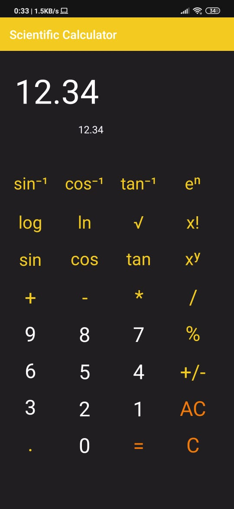

# ScientificCalculator

This is a Scientific Calculator App which along with the basic operations like Addition, Subtraction, Multiplication and Division, can also perform Trigonometric, Logarithmic, Inverse Trigonometric and many other scientific operations. It follows a simple user interface and focuses on making user experience better and easier. This Scientific Calculator is the perfect app for Engineering Students. This app was created using Java language on Android Studio and is supported for all Android versions 4.0 and above.

This app is unique, since it follows an argument-function-result workflow, unlike the regular function-argument-result process. This makes calculations easier and faster.

The project was built on Android Studio (version- 3.5.3) by
* [Gaurang Velingkar](https://github.com/gaurang2001)
* [Jason Krithik Kumar](https://github.com/jkk2000)
* [Gaurav Singh](https://github.com/gaurav2699)
* [Abhinav Dugar](https://github.com/abhid2001)

---

## Project Setup

 1. Clone the repository using git
```
git clone https://github.com/gaurang2001/ScientificCalculator.git
```

 2. Open the cloned repository on Android Studio.
 3. Run the project on an Android Virtual Device (AVD) or an android phone


## Screenshots

</img>

## Implemented features

 * Regular aritmetic functions like + , - , * , / , % , +/-
 * Scientific functions like sin, cos, tan, x<sup>y</sup>, sin<sup>-1</sup>, cos<sup>-1</sup>, tan<sup>-1</sup>, log, ln, root, x!, e<sup>x</sup>
 * Exception Handling
 * User-friendly interface
